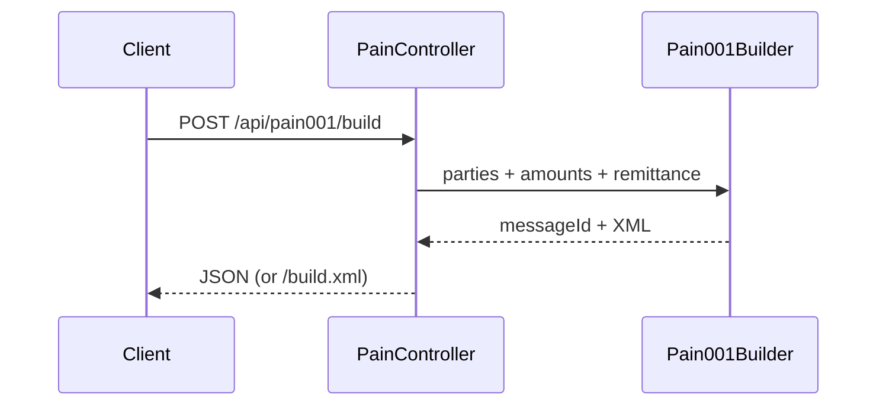

# ISO 20022 pain.001 Lite

Builds a **simplified** ISO 20022 Customer Credit Transfer Initiation (`pain.001.001.03`-style) XML document from JSON.

Inspired by the pain.001 generation idea in projects such as [bank4j](https://github.com/inisos/bank4j) (MIT). This code is an independent lite builder for learning and demos, not a full XSD-validated payments stack.

## Architecture



## Quick start

```bash
./mvnw test
./mvnw spring-boot:run
```

HTTP: `http://localhost:8087`

## License

[MIT](LICENSE)

## Notes

Not a full XSD-validated payments stack; use for learning and demos.

