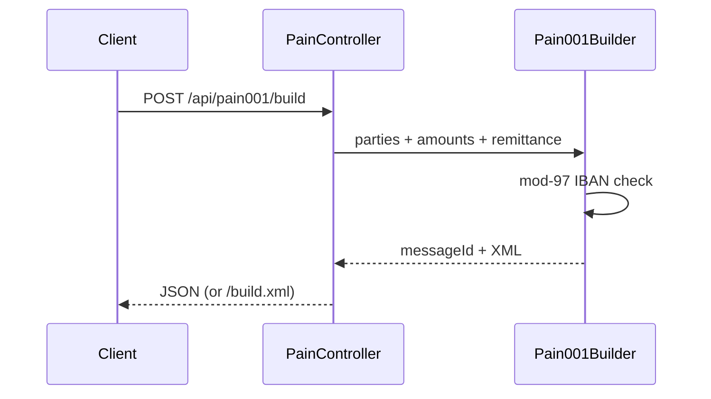
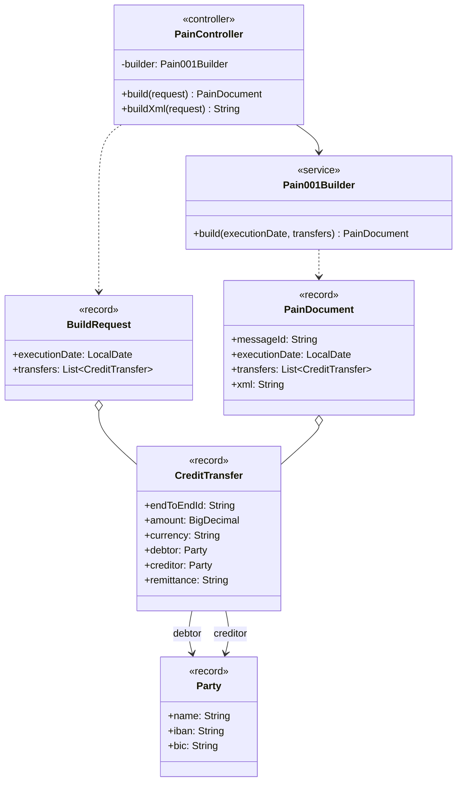

# ISO 20022 pain.001 Lite

Builds a **simplified** ISO 20022 Customer Credit Transfer Initiation (`pain.001.001.03`-style) XML document from JSON.

Inspired by the pain.001 generation idea in projects such as [bank4j](https://github.com/inisos/bank4j) (MIT). This code is an independent lite builder for learning and demos, not a full XSD-validated payments stack.

## Scope (honest)

This is a learning / portfolio builder, not a production payments stack.

| Capability | Status |
|------------|--------|
| Simplified pain.001.001.03-style XML generation | Implemented |
| Debtor/creditor IBAN mod-97 check | Implemented |
| Full XSD schema validation | Not included |
| Other pain/pacs message types, batch settlement | Not included |
| Bank / payment-rail connectivity | Not included |
| Persistence of generated messages | Not included (stateless builder) |

## Architecture



## API

| Method | Path | Produces |
|--------|------|----------|
| `POST` | `/api/pain001/build` | JSON with `messageId`, `executionDate`, `transfers`, `xml` |
| `POST` | `/api/pain001/build.xml` | raw XML |
| `GET` | `/api/pain001/health` | health |

### Example request

```bash
curl -s -X POST http://localhost:8087/api/pain001/build \
  -H "Content-Type: application/json" \
  -d "{
    \"executionDate\": \"2026-05-10\",
    \"transfers\": [{
      \"endToEndId\": \"E2E-1\",
      \"amount\": 1250.50,
      \"currency\": \"EUR\",
      \"debtor\": {\"name\": \"Alice GmbH\", \"iban\": \"DE89370400440532013000\", \"bic\": \"COBADEFFXXX\"},
      \"creditor\": {\"name\": \"Bob Ltd\", \"iban\": \"GB82WEST12345698765432\", \"bic\": \"WESTGB22XXX\"},
      \"remittance\": \"Invoice 42\"
    }]
  }"
```

## Domain model

Class-level view of the main types and how they relate (fields, operations and dependencies).



## Quick start

```bash
./mvnw test
./mvnw spring-boot:run
```

HTTP: `http://localhost:8087`

## Notes

Not a full XSD-validated payments stack; use for learning and demos. Debtor/creditor IBANs must pass mod-97.

## License

[MIT](LICENSE)
